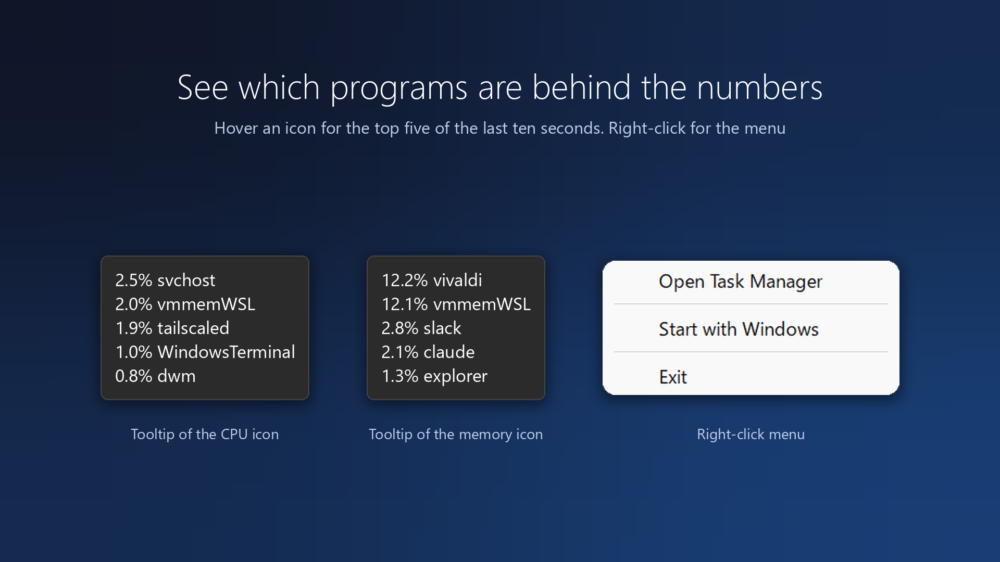
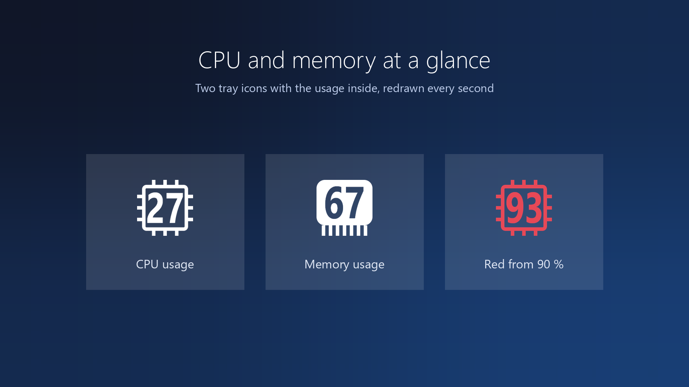

# PerformanceTray

[](https://github.com/9enki/performance-tray/actions/workflows/ci.yml)

A tiny tray app that shows the CPU usage and the memory usage of a Windows 10 / 11 PC as numbers
in the system tray, updated once a second, and names the programs behind them on hover.



- **Two icons**: a chip outline for the CPU and a memory module for the memory, each with the usage
  percentage inside, so the two are easy to tell apart at a glance
- **Tooltips name the culprits**: the CPU icon lists the five programs that used the most CPU over the
  last ten seconds, the memory icon the five that hold the most memory, each with its share
  (`9.9% vivaldi`, `1.8% svchost`, …)
- **Red at 90 % and above**, for either value
- **Left click** opens Task Manager. **Right click**: open Task Manager, turn "Start with Windows" on or off, or quit
- Follows the light / dark taskbar theme and the display scaling (16 px icons at 100 %, 24 px at 150 %)
- A single executable of about 200 KB written in Rust against the Win32 API only. No GUI framework,
  no extra runtime, and about 2.5 MB of private memory while resident
- Speaks 11 languages and follows the Windows display language
- No administrator rights. Nothing is written to disk, and the only registry write is the opt-in "Start with Windows" entry. The Microsoft Store build toggles the Windows startup task instead and writes nothing

## Usage

```
PerformanceTray.exe [--show cpu|memory|both] [--lang <lang>]
```

| Argument | Meaning |
| --- | --- |
| (none) | Show both icons |
| `--show cpu` / `--show memory` | Show only one icon |
| `--lang en` | Force the interface language instead of following Windows |
| `--help` | Show this help |

- **CPU** is the share of time the processors were not idle since the previous sample, taken from
  `GetSystemTimes`. It is the classic "% Processor Time". The headline figure in the Windows 10 / 11
  Task Manager is "% Processor Utility", which also weighs the clock frequency, so the two can differ
- **Memory** is the physical memory in use: the installed amount minus what Windows reports as
  available, the same numbers Task Manager shows on its Memory page
- **Tooltips** are refreshed every ten seconds. Processes with the same image name (all the `chrome.exe`
  processes, for example) are added up and shown as one program, without the `.exe`. The CPU share is
  measured against the total capacity of all cores, like the icon. The memory share is the private
  working set, the figure in Task Manager's Memory column, against the installed memory. For the first
  ten seconds after launch the CPU tooltip reads "Measuring…". While a tooltip is open, its icon is not
  redrawn, because Explorer closes the tooltip whenever the icon changes; it catches up the moment the
  tooltip closes
- For the first second after launch the CPU icon shows a dim `--`, because two samples are needed for a rate
- A second instance exits silently. To change arguments, quit from the right-click menu first, then start it again



### Languages

The interface follows the Windows display language and falls back to English for anything not listed:
English, Japanese, Chinese (Simplified and Traditional), Korean, German, French, Spanish, Portuguese, Italian and Russian.
Pass `--lang <code>` to pick one yourself, for example `--lang en` on a Japanese system.

Translations other than English and Japanese were produced without a native speaker review,
so corrections are welcome as issues or pull requests.

### Starting with Windows

"Start with Windows" in the right-click menu turns auto-start on and off at any time. It is off by default.
Turning it on writes one value under the per-user `Run` key that points at the executable and carries the
current `--show` setting. Turning it off removes that value. The entry also shows up under
Startup apps in Task Manager, so it can be disabled from there as well.

The Microsoft Store (MSIX) build cannot use the `Run` key: registry writes from a packaged app land in a
private hive that Explorer never reads, and an executable under `WindowsApps` cannot be launched from there
anyway. That build therefore toggles the package's startup task through the Windows `StartupTask` API.
It is the same switch as Settings > Apps > Startup. If it was turned off there, the menu item cannot turn
it back on and opens that page instead. The startup task launches the app without arguments, so the Store
build always starts with both icons.

### Keeping the icons out of the overflow menu

On first launch the icons land in the taskbar overflow, behind the `^` button. To show them permanently,
open the `^` flyout and drag each icon onto the taskbar. Windows 11 remembers this per icon.

The switch under Settings > Personalization > Taskbar > Other system tray icons only reaches the first
icon of an executable (the CPU icon here), because that page lists one row per program, so dragging is
the way to get both. Windows stores all of this per executable path, so moving the file means setting
it again, and each old path would leave a stale row in that Settings page. `install.ps1` removes the rows
of every other path, such as a copy started from `bin\`, so only the installed copy is listed.

## Installation

### From source

Building needs Rust ([rustup](https://rustup.rs/), `stable-x86_64-pc-windows-msvc`) and the
"Desktop development with C++" workload of the Visual Studio Build Tools, which provides the linker and the Windows SDK.

```powershell
# From WSL
powershell.exe -NoProfile -ExecutionPolicy Bypass -File install.ps1

# From PowerShell on Windows
.\install.ps1
```

`install.ps1` builds the app, stops any running instance, copies the executable over
`%LOCALAPPDATA%\Programs\PerformanceTray\`, puts a shortcut in the Start menu so that Start search finds the
app, and starts it. The same command also updates an existing install.
Because the destination never changes, the tray visibility setting survives updates.

On a first install it asks whether to start the app at sign-in. Pass `-Startup` or `-NoStartup` to answer
in advance, which is also what a non-interactive run needs. On an update the current setting is kept.

| Option | Meaning |
| --- | --- |
| `-Show cpu` | Value passed as `--show` (`cpu`, `memory` or `both`). Defaults to the value already stored in the auto-start entry, or both |
| `-Startup` | Start the app at sign-in |
| `-NoStartup` | Do not start the app at sign-in |
| `-NoBuild` | Skip the build and deploy the existing `bin\PerformanceTray.exe` |
| `-NoLaunch` | Deploy without starting the app |
| `-Uninstall` | Stop the app and remove the install folder, the Start menu shortcut, the auto-start entry and the tray icon settings |

### winget

The release executable is published through [microsoft/winget-pkgs](https://github.com/microsoft/winget-pkgs)
(available once the package is accepted).

```powershell
winget install 9enki.PerformanceTray
winget upgrade 9enki.PerformanceTray
```

## About side effects

- The app only reads. `GetSystemTimes` and `GlobalMemoryStatusEx` are called once a second, the process
  list is read once every ten seconds, and one registry value is read to follow the light / dark theme
- Nothing is written to disk. The only registry write is the "Start with Windows" value, created only
  when you turn that option on and deleted when you turn it off. The Store build toggles the Windows
  startup task instead
- No administrator rights. The manifest declares `asInvoker`
- The only thing it ever launches is Task Manager, and only when you click
- No extra runtime and no GUI framework. Only DLLs that ship with Windows are loaded
- A mutex prevents a second instance

Measured while resident on real hardware (Windows 11, about 330 processes):

| Metric | Value |
| --- | --- |
| Private memory | about 2.5 MB, of which about 0.7 MB is the buffer that receives the process list |
| Working set | about 11 MB |
| CPU | about 0.3 % of one core, measured as processor cycles over 30 seconds. An icon is redrawn only when its digits or the theme change |
| Threads / handles / GDI objects | 4 / about 135 / 10, all flat over time |

## How it works

`GetSystemTimes` returns the cumulative idle, kernel and user time of all processors, and the kernel
time includes the idle time. Two samples a second apart give the usage as
`1 - Δidle / (Δkernel + Δuser)`. `GlobalMemoryStatusEx` returns the installed and the available
physical memory in bytes. Both calls are documented and need no privileges.

The tooltips come from `NtQuerySystemInformation(SystemProcessInformation)`, the call Task Manager
itself uses. One call returns the image name, the kernel and user time and the private working set of
every process, without opening any of them, so no process is missed for lack of rights. Microsoft
documents the function with the caveat that it may change, but the leading part of the structure that
this app reads has been stable since Windows Vista. Two snapshots ten seconds apart give each program's
share of the CPU as its time delta over the system-wide delta; the memory share is the private working
set over the installed memory.

The icons are drawn with GDI: the digits are rendered in Segoe UI Bold into a 32-bit bitmap, the
coverage becomes the alpha channel, and the font is condensed horizontally through the width parameter
of `CreateFont` when the digits would not fit. The chip and the module around them are computed per
pixel as coverage of rectangles and rounded rectangles, so the edges stay smooth at any icon size.

## Development

| Command | Purpose |
| --- | --- |
| `.\build.ps1` | Runs `cargo build --release` and copies the result to `bin\PerformanceTray.exe`. The version comes from `version` in `Cargo.toml` |
| `.\test.ps1` | Runs `cargo test`, covering argument parsing, the usage arithmetic, the process ranking and tooltip formatting, the icon geometry, and the interface strings |

`cargo build --release` and `cargo test` work directly too. From WSL, run
`powershell.exe -NoProfile -ExecutionPolicy Bypass -File <script>`
(builds on a `\\wsl.localhost` path are slow, so the scripts point `CARGO_TARGET_DIR` at a Windows temp folder).
Save `.ps1` files as UTF-8 with a BOM, since they contain Japanese and Windows PowerShell 5.1 reads BOM-less files as Shift-JIS.

There are two dependencies: `windows-sys` for the raw Win32 bindings, and `embed-resource` at build time
for the version resource and the application manifest.

## Layout

| Path | Contents |
| --- | --- |
| `src/main.rs` | Window, message loop, timer, menu, and the two tray icons' state |
| `src/stats.rs` | Reading the CPU times and the memory status, and the percentage arithmetic, with unit tests |
| `src/procs.rs` | Reading the process list, ranking programs by CPU and memory, and formatting the tooltips, with unit tests |
| `src/tray.rs` | Icon rendering (digits, chip and module drawn with GDI and per-pixel coverage) and Shell_NotifyIcon |
| `src/cli.rs` | Command-line parsing, with unit tests |
| `src/i18n.rs` | Interface strings for every supported language and the language detection |
| `src/startup.rs` | Reading and writing the "Start with Windows" setting: the `Run` key, or the startup task in the MSIX build |
| `build.rs` / `app.manifest` | Embeds the version resource and the manifest declaring no elevation and per-monitor DPI awareness |
| `Cargo.toml` | Dependencies and version |
| `build.ps1` / `test.ps1` / `install.ps1` | Build, test, and personal install |
| `scripts/common.ps1` | Helpers shared by the scripts |
| `winget/` / `msix/` | Generation of the distribution packages (winget manifests, MSIX) |
| `.github/workflows/` | CI and release automation |

## Privacy

The app collects no data, makes no network connections, and writes nothing to the registry or disk.
See [PRIVACY.md](PRIVACY.md).

## License

MIT License
